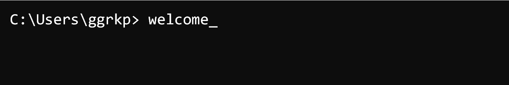

<!-- todo: Header Image me stoixeia mou endexomenws kai link sto portfolio mou -->
# 

## > about_ 
Lorem ipsum dolor sit amet, consectetur adipiscing elit. Ut lacinia euismod risus, id bibendum lectus congue ac. Vivamus at ligula at felis accumsan viverra nec sit amet justo. Nulla dignissim maximus risus, et auctor leo dictum ac. Integer tristique, nulla vitae tristique accumsan, enim justo pulvinar est, in laoreet nunc elit et ipsum.
## > projects_

<!--  -->

## > languages & tools_
 an viverra nec sit amet justo. Nulla dignissim maximus risus, et auctor leo dictum ac. 

## > connect_

<!-- Please don't remove this: Grab your social icons from https://github.com/carlsednaoui/gitsocial -->

Lorem ipsum dolor sit amet, consectetur adipiscing elit. Ut lacinia euismod risus, id bibendum lectus congue ac. Vivamus at ligula at felis accumsan viverra nec sit amet justo. 

  

<!-- ## .stats
Lorem ipsum dolor sit amet, consectetur adipiscing elit. Ut lacinia euismod risus, id bibendum lectus congue ac. Vivamus at ligula at felis accumsan viverra nec sit amet justo. Nulla dignissim maximus risus, et auctor leo dictum ac. Integer tristique, nulla vitae tristique accumsan, enim justo pulvinar est, in laoreet nunc elit et ipsum. Aliquam facilisis laoreet ligula scelerisque vulputate. Ut at sem elementum, tincidunt magna eget, auctor turpis. Nullam lacinia sed dolor sed imperdiet. Cras porttitor lacus id tellus vulputate, vitae sodales mi sollicitudin. Duis sagittis urna et laoreet placerat. Sed nec eros non quam fermentum lobortis. Suspendisse potenti. Donec et eros imperdiet, tincidunt tellus ac, feugiat urna. Maecenas posuere ipsum arcu, nec aliquam eros interdum id. Vestibulum condimentum sapien odio, nec condimentum enim euismod ut. --> 

